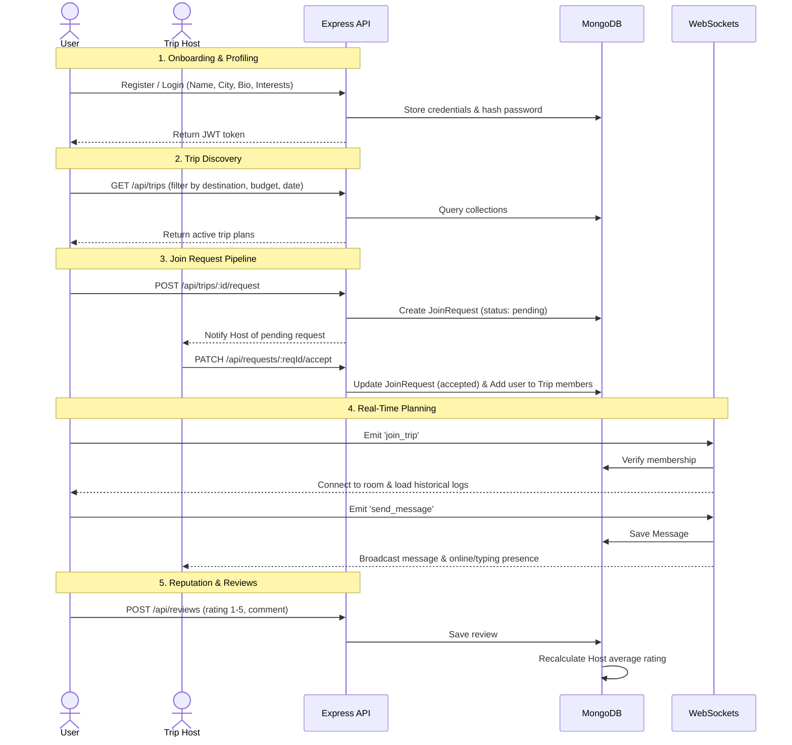

# TripConnect &mdash; Full-Stack Travel Companion matching platform

TripConnect is a modern, responsive, premium web platform where solo travelers can find travel buddies for their planned itineraries. Users can create trip plans, discover other trips, submit requests to join, chat in real-time in group chats, and review co-travelers to build trust.

This repository is built as a clean, decoupled monorepo structured with separate frontend and backend directories, optimizing local development speed and production deployment flexibility.

---

## 🏛️ System Architecture

TripConnect uses a decoupled client-server architecture:

```mermaid
graph TD
    subgraph Frontend Client (Vercel)
        A[React 19 + Vite] --> B[Axios HTTP Client]
        A --> C[Socket.io-client]
    end

    subgraph Backend Server (Render)
        D[Express.js App] --> E[REST Controllers]
        F[Socket.io Server] --> G[Real-Time Events]
    end

    subgraph Database (MongoDB Atlas)
        E --> H[(Mongoose Models)]
        G --> H
    end

    B -->|HTTP Requests| D
    C -->|WebSockets WS| F
```

1. **Frontend (Vite + React 19)**: A fast, single-page application (SPA). Styling is isolated via CSS Modules for a glassmorphism dark theme. State is managed via Context Providers (`AuthContext` for auth/token management, `SocketContext` for WS connection).
2. **Backend (Express + Socket.io)**: Houses all REST endpoints, validation middlewares, rate limiters, and the WebSockets server instance.
3. **Database (MongoDB Atlas + Mongoose)**: Serves as the persistence layer. Uses compound indexing to enforce unique requests/reviews, and hooks to aggregate metrics.

---

## 🔄 Core User Workflow

The application operates in five primary steps:



---

## 📁 Workspace Folder Structure

```txt
Trip-connect/
  ├── backend/           # Node.js backend (CORS, Express, Socket.io)
  │    ├── config/       # DB connection config
  │    ├── controllers/  # Route controller controllers
  │    ├── middleware/   # JWT protection interceptors
  │    ├── models/       # Mongoose Schemas (User, Trip, JoinRequest, etc.)
  │    ├── routes/       # REST route mappings
  │    ├── sockets/      # Socket.IO connection event logic
  │    ├── utils/        # Database seed script
  │    └── server.js     # Bootstrapping entry point
  ├── frontend/          # Vite frontend (React 19, CSS Modules)
  │    ├── src/
  │    │    ├── components/ # Atomic UI components (Navbar, ChatBox, etc.)
  │    │    ├── context/    # Context providers (Auth, Socket)
  │    │    ├── pages/      # Route view templates (Landing, Profile, etc.)
  │    │    └── main.jsx    # React mounting point
  │    ├── vite.config.js # Vite configuration & proxying
  │    └── vercel.json   # Vercel SPA routing configurations
  ├── package.json       # Root coordinator script
  └── README.md          # Main document guide
```

---

## 🛠️ Local Development

### 1. Install Dependencies
Run from the root directory to install all packages for both frontend and backend concurrently:
```bash
npm run install-all
```

### 2. Configure Local Environment Files
- **Backend Setup**: Create [backend/.env](file:///c:/Users/yoges/Desktop/GitHub/Trip-connect/backend/.env):
  ```env
  PORT=5000
  NODE_ENV=development
  MONGODB_URI=mongodb://127.0.0.1:27017/tripconnect
  JWT_SECRET=super_secret_tripconnect_token_key_123
  ```
- **Frontend Setup**: Create [frontend/.env](file:///c:/Users/yoges/Desktop/GitHub/Trip-connect/frontend/.env):
  ```env
  VITE_API_URL=http://localhost:5000
  ```

### 3. Load Sample Mock Data
Ensure MongoDB is running locally, then execute the seed command:
```bash
npm run seed --prefix backend
```

### 4. Start Development Servers
Run the concurrent dev command in the root folder:
```bash
npm run dev
```
- Frontend starts at: `http://localhost:5173`
- Backend starts at: `http://localhost:5000`

---

## 🚀 Production Deployment Guide

You can deploy the frontend and backend separately on Vercel and Render:

### 1. Deployed Backend (Render)
- **Service Type**: Web Service
- **Root Directory**: `backend`
- **Build Command**: `npm install`
- **Start Command**: `npm start`
- **Environment Variables**: Add your production `MONGODB_URI`, `JWT_SECRET`, and `NODE_ENV=production`.

### 2. Deployed Frontend (Vercel)
- **Root Directory**: `frontend`
- **Framework Preset**: `Vite`
- **Build Command**: `npm run build`
- **Output Directory**: `dist`
- **Environment Variables**: Set `VITE_API_URL` pointing to your deployed Render URL (e.g. `https://tripconnect-api.onrender.com`).
- **Routing**: Virtual paths are handled automatically by the included `vercel.json` SPA configurations.
